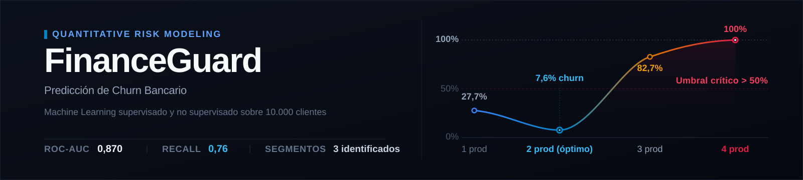
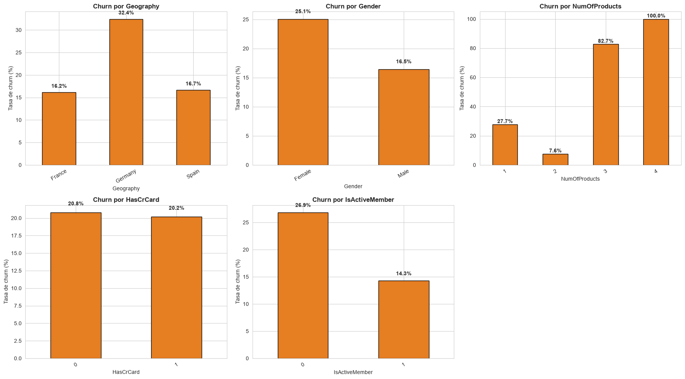
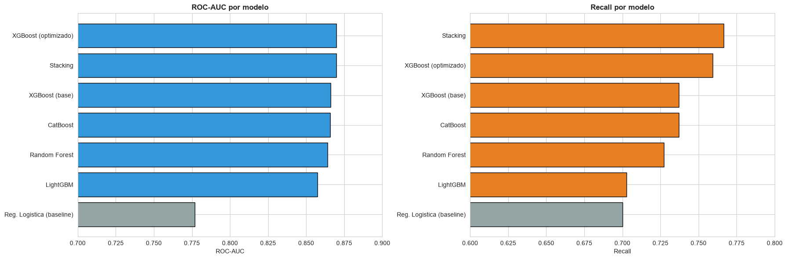
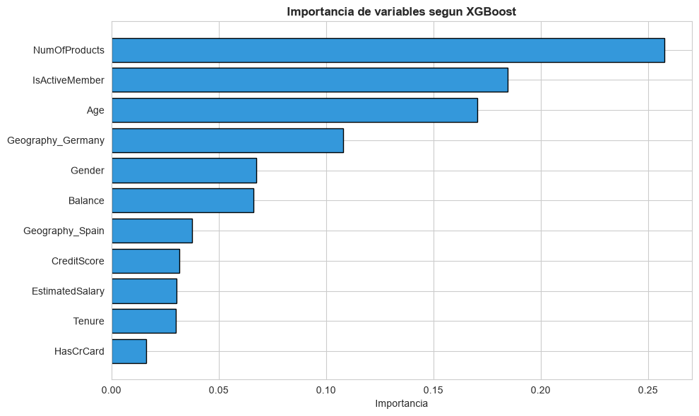
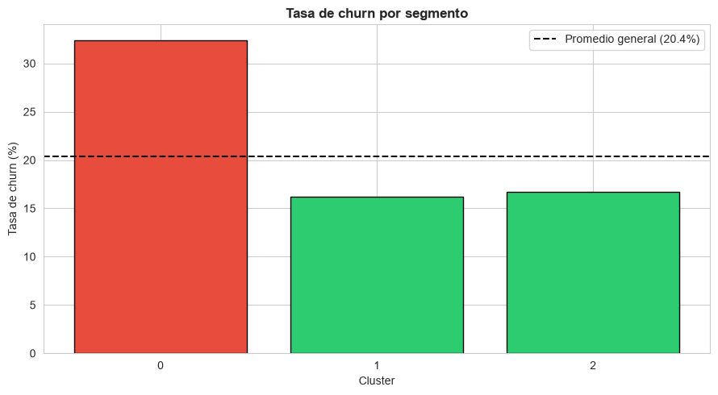

<p align="center">
  
</p>

<p align="center">
  
  
  
  
  
</p>

Sistema de predicción y segmentación de abandono de clientes (churn) para un banco digital, desarrollado como Proyecto Integrador del Módulo 4 de la carrera de Data Science en Soy Henry.

## El problema en una línea

FinanceGuard pierde **uno de cada cinco clientes cada año** y quiere bajar esa tasa del 20% al 15%. Retener cuesta menos que adquirir, así que la pregunta es: **¿a quién hay que contactar antes de que se vaya?**

|  |  |
| --- | --- |
| **Modelo elegido** | XGBoost optimizado |
| **ROC-AUC** | 0,870 |
| **Recall sobre la clase de interés** | 0,76 |
| **Segmentos identificados** | 3, sin usar la variable objetivo |
| **Clientes analizados** | 10.000 · 14 variables · sin nulos ni duplicados |

## Los tres hallazgos que definieron el proyecto

<p align="center">
  
</p>

**Alemania abandona al doble.** Un 32,4% frente al 16,2% de Francia y el 16,7% de España. No es una diferencia marginal: es el segmento que concentra el problema.

**El número de productos no se comporta como uno esperaría.** Con dos productos el churn cae al 7,6%, su punto mínimo. Con tres sube al 82,7% y con cuatro llega al 100%. Esa curva en U apunta a un problema concreto en la venta cruzada que el banco debería revisar con urgencia — y fue la razón por la que los modelos de árboles superaron a la regresión logística, que no captura relaciones no lineales.

**Ser miembro activo protege.** 14,3% de churn frente al 26,9% de los inactivos. Es, además, una variable sobre la que el negocio sí puede actuar.

## Comparación de modelos

Se entrenaron seis modelos cubriendo las dos estrategias de ensamblado —bagging y boosting— todos con manejo del desbalance de clases.

<p align="center">
  
</p>

| Modelo | ROC-AUC | Recall |
| --- | --- | --- |
| Regresión Logística (base) | 0,777 | 0,70 |
| Random Forest | 0,864 | 0,73 |
| LightGBM | 0,858 | 0,70 |
| CatBoost | 0,866 | 0,74 |
| **XGBoost optimizado** | **0,870** | **0,76** |
| Stacking | 0,870 | 0,77 |

**Por qué XGBoost y no el Stacking**, si empataron: el Stacking combina tres modelos de boosting más un metamodelo, y no logró superar a un solo XGBoost bien optimizado. A igual desempeño, el modelo más simple es más fácil de mantener, explicar y poner en producción. La complejidad tiene que ganarse su lugar.

<details>
<summary><b>Por qué se priorizó el recall y no la exactitud</b></summary>

<br>

Con un 80% de clientes que se quedan, un modelo que prediga siempre "no se va" alcanza un 80% de exactitud sin haber aprendido nada. Por eso toda la evaluación se centró en la clase minoritaria.

El desbalance se manejó con `class_weight='balanced'` en los modelos que lo permiten y con `scale_pos_weight` en los de boosting. El criterio de negocio detrás: no detectar a un cliente que se va cuesta más que una falsa alarma, porque el primero es ingreso perdido y el segundo, una llamada de más.

</details>

<details>
<summary><b>Validación cruzada: por qué StratifiedKFold</b></summary>

<br>

Se compararon tres estrategias sobre el mismo modelo:

| Estrategia | ROC-AUC |
| --- | --- |
| K-Fold | 0,867 |
| StratifiedKFold | 0,866 |
| TimeSeriesSplit | 0,858 |

**StratifiedKFold** es la correcta acá porque garantiza que cada pliegue conserve la proporción de churn del 20%, evitando que alguno quede con muy pocos casos positivos.

**TimeSeriesSplit se incluyó solo para la comparación, y usarla sería un error conceptual**: este dataset no tiene dimensión temporal, los clientes no están ordenados en el tiempo. No hay un pasado y un futuro que respetar.

</details>

## Qué variables pesan más

<p align="center">
  
</p>

El análisis de importancia confirmó la hipótesis del análisis exploratorio: los modelos de árboles sí aprovechan el efecto no lineal del número de productos, que la regresión logística desperdiciaba. Esa es una de las razones concretas de su mejor desempeño.

## Segmentación: dos caminos, la misma conclusión

Se aplicó K-Means (K=3, elegido por el método del codo y el coeficiente de silueta) **sin darle al modelo la variable de abandono**. Los tres segmentos resultaron corresponder a los tres países.

<p align="center">
  
</p>

Al cruzarlos con el churn real, el segmento alemán apareció en 32,4%, muy por encima del promedio general de 20,4%.

**Este es el resultado más sólido del proyecto:** el aprendizaje no supervisado encontró por su cuenta el mismo grupo de alto riesgo que los modelos supervisados ya habían señalado. Dos enfoques independientes llegando a la misma conclusión refuerzan la validez de ambos.

<details>
<summary><b>Las otras técnicas aplicadas: DBSCAN, PCA y t-SNE</b></summary>

<br>

**DBSCAN** se usó como complemento para detectar clientes atípicos por densidad, no para segmentar.

**PCA** reveló que las variables están poco correlacionadas entre sí: la varianza se reparte entre muchos componentes, lo que limita la compresión pero es informativo por sí mismo.

**t-SNE** confirmó visualmente la estructura de los grupos. Con una precaución: sus ejes no son interpretables y las distancias entre grupos en el gráfico no son fiables, así que sirve para explorar, no para concluir.

Del clustering se derivaron dos variables nuevas: la etiqueta de segmento y un ranking de riesgo.

</details>

## Recomendaciones de negocio

1. **Desplegar el XGBoost optimizado** para asignar un puntaje de riesgo a cada cliente y priorizar los contactos de retención.
2. **Priorizar el mercado de Alemania**, el segmento de mayor riesgo y mayor saldo.
3. **Actuar sobre las variables accionables**: fomentar la contratación de un segundo producto —el punto óptimo— e impulsar la actividad del cliente, el mayor factor protector.
4. **Monitorear el modelo en producción** y reentrenarlo periódicamente.

Los modelos supervisados responden **a quién** contactar; la segmentación responde **cómo** agrupar las acciones. Ambos enfoques se complementan.

## El dataset

10.000 clientes y 14 variables, sin valores nulos ni duplicados.

| Tipo | Variables |
| --- | --- |
| Demográficas | Edad, género, país (Francia, Alemania, España) |
| Financieras | Saldo, salario estimado, puntaje de crédito |
| Comportamiento | Antigüedad, número de productos, tarjeta de crédito, membresía activa |

La variable objetivo es `Exited`. El desafío central es el **desbalance de clases**: solo el 20% de los clientes abandona.

## Estructura del repositorio

```
├── notebooks/
│   ├── 1_EDA_RegresionLogistica.ipynb          # Análisis exploratorio y modelo base
│   ├── 2_GradientBoosting_Optimizacion.ipynb   # Ensambles, optimización y stacking
│   └── 3_AprendizajeNoSupervisado.ipynb        # Segmentación de clientes
├── data/
│   ├── Churn_Modelling.csv                     # Dataset original
│   └── churn_transformado.csv                  # Generado por el notebook 1
├── docs/
│   └── Reporte_Modelos.pdf                     # Reporte de modelos en PDF
├── assets/                                     # Gráficos usados en este README
├── requirements.txt
└── README.md
```

Los notebooks están encadenados: el primero limpia y codifica los datos y los exporta a `data/churn_transformado.csv`, y los otros dos los cargan desde ahí. Ejecutarlos en orden.

## Cómo reproducirlo

```bash
git clone https://github.com/simonbm17/bank-churn-prediction.git
cd bank-churn-prediction
pip install -r requirements.txt
jupyter notebook
```

## Tecnologías

Python · pandas · scikit-learn · XGBoost · LightGBM · CatBoost · statsmodels · matplotlib · seaborn

## Autor

**Simón Bedoya** — Data Science, Soy Henry

[](https://www.linkedin.com/in/sim%C3%B3n-bedoya-05bb57398/)
